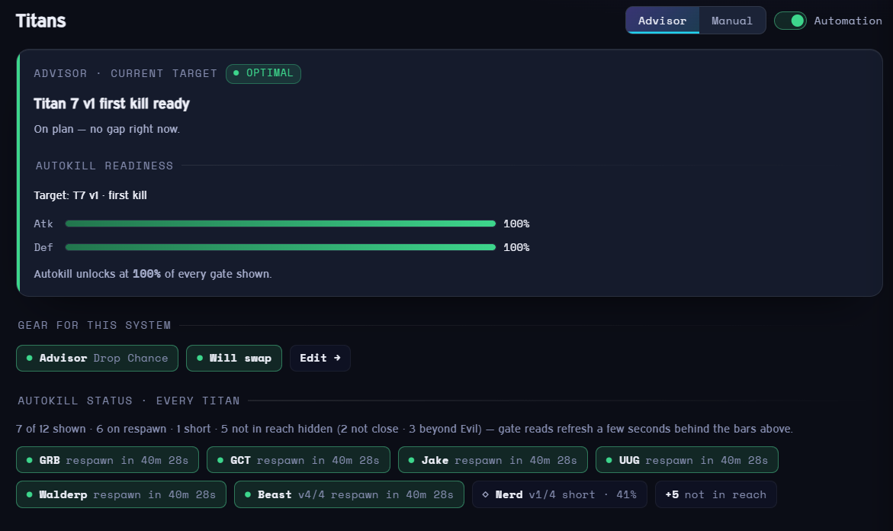
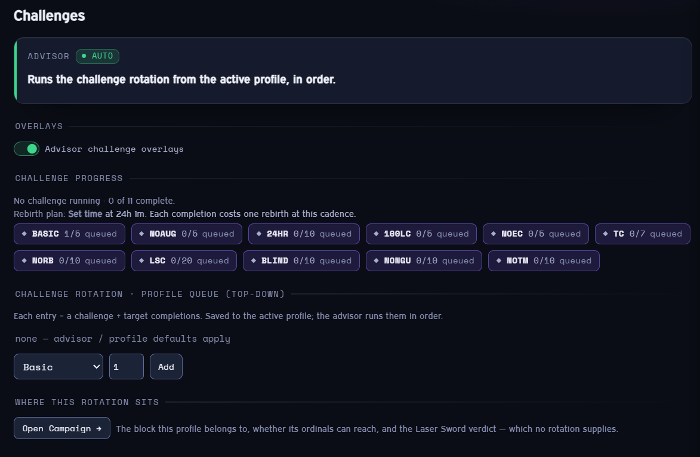
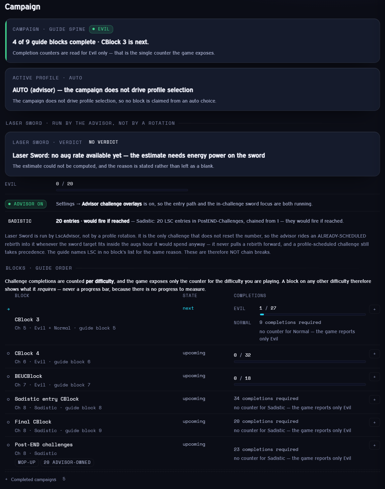
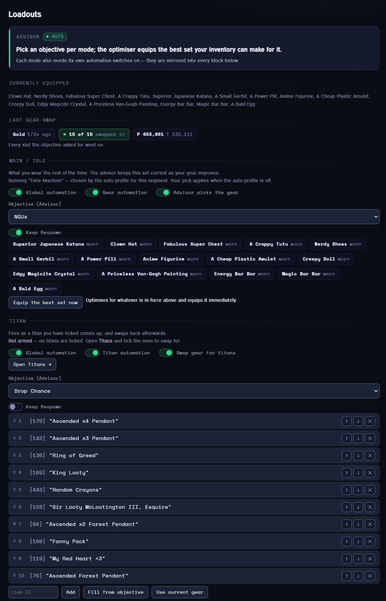
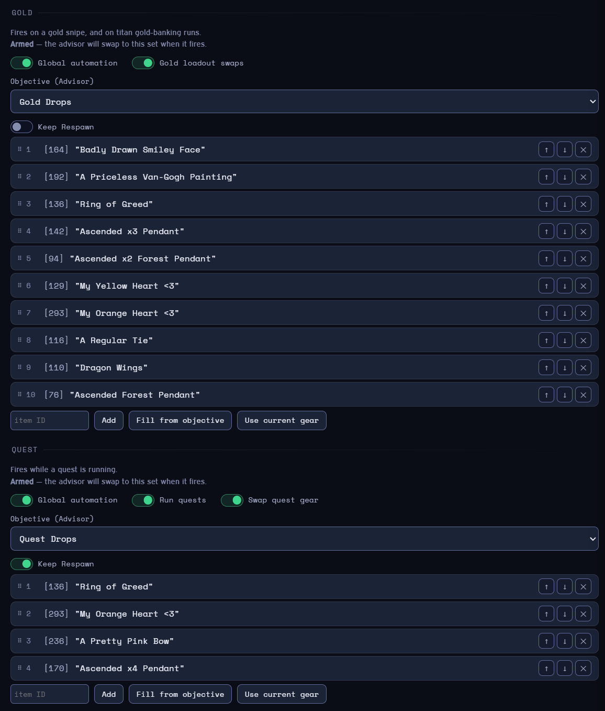
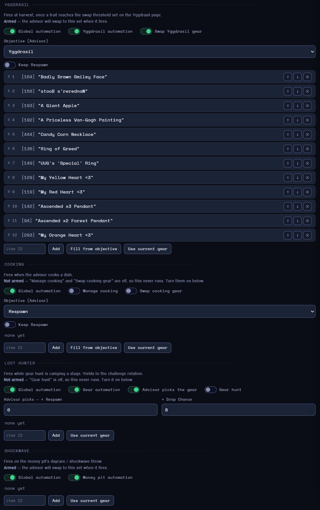
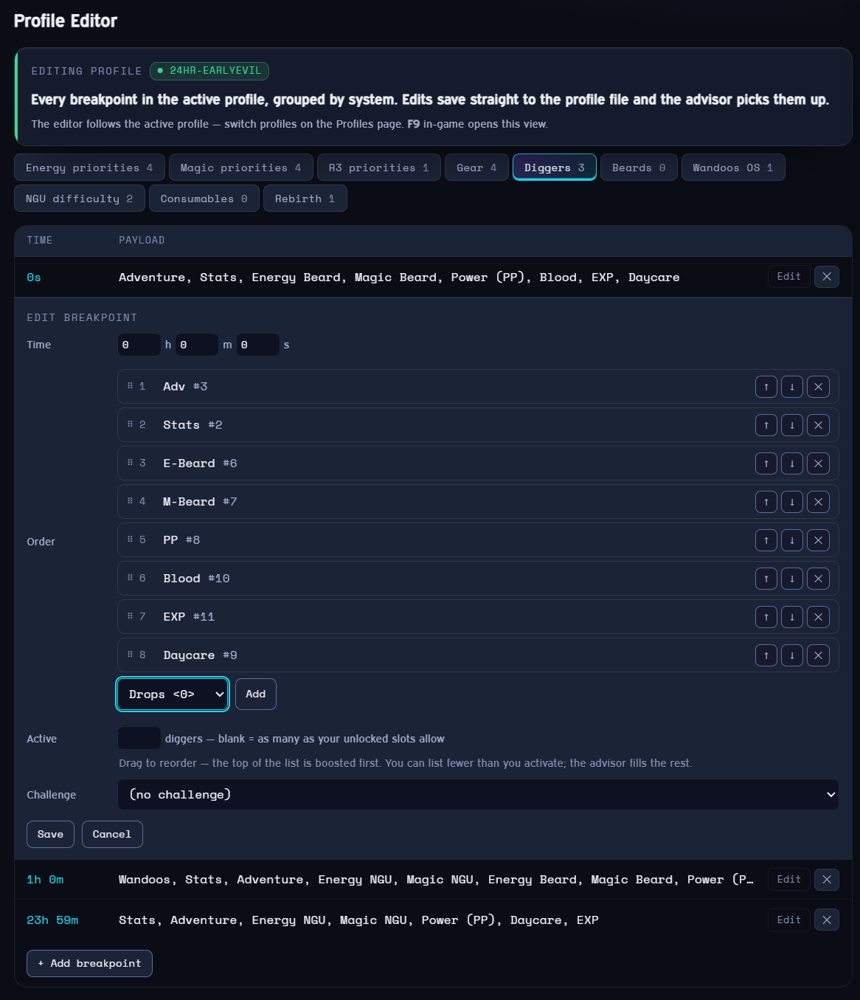
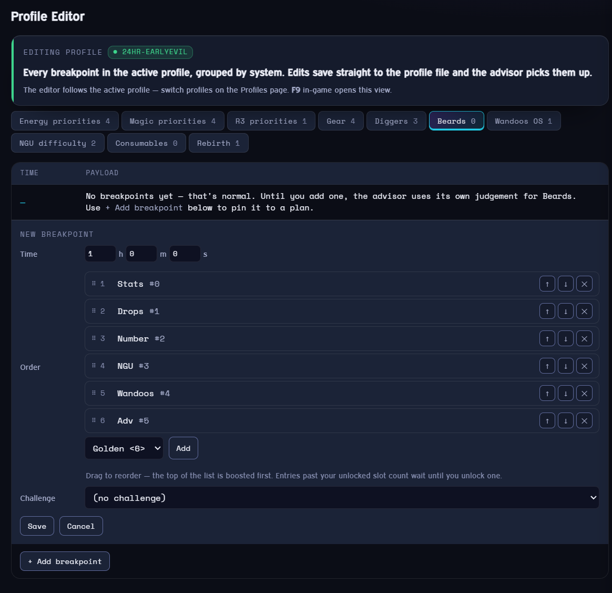

# NGU Advisor

NGU Advisor is an automation platform and advisor for the Steam version of NGU Idle. An injected DLL runs
the automation in-game; a separate **companion window** is the configuration surface and live dashboard.

**Version 2.4.1** — the advisor owns the percentages.

### New in 2.4.1

The allocator now decides how much every system gets, sized from what that system can actually
absorb this tick. What changed for you day to day:

- **`:P` on a priority now means MANUAL MODE, not "cap it at P%".** You no longer need percentages
  at all — the advisor sizes every lane from live capacities, and that is the recommended setup.
  Writing `:P` tells it to **stop optimising that system**; the lane takes P% off the top and leaves
  the optimiser. **The shipped presets and sample profiles have been migrated for you**, so they
  behave exactly as before. If you hand-wrote a profile with `:P` on an Energy or Magic priority,
  read the [Resource priorities](#resource-priorities-energy--magic--r3) section — there are two
  things it deliberately cannot do.
- **R3 picks the hack actually worth the most.** After the guide's first-milestone sweep, R3 used to
  park on the Adventure hack forever. It is now priced every minute from live game values. On a
  mature board the Adventure hack ranked eleventh of fifteen.
- **Idle energy and magic before wishes unlock now gets used.** A share of the pool was reserved for
  Wandoos each round beyond what Wandoos can absorb, and before a T8 titan kill nothing else could
  claim it — measured at 26% of energy and 30% of magic on a live save.
- **A profile gear row that lists item IDs now holds** instead of being overwritten by your standing
  pick within the same second.
- **Beards fill limited slots in a set order**, and wishes can be chosen by **value** rather than
  only by speed or price.

Settings and profiles carry over. Full detail in [CHANGELOG.md](CHANGELOG.md).

# Install & update

1. Download the latest release from the [releases page](https://github.com/Glowey-Glow/NGUAdvisor/releases)
   — grab the zip named for the version (`NGUAdvisor_2.4.1.zip`), **not** the source archive.
2. Extract it anywhere.
3. With **NGU Idle open**, run **`Advisor Launcher.exe`** (or the `Run NGU Advisor.bat` fallback).

Injection worked when the advisor overlay appears in the top-left of NGU.

<!-- TODO(user): add docs/screenshots/injected.png (the in-game overlay) to show it here. -->

**To update:** close the companion, unload from **Settings → Unload** (or just close the game), then inject
the new version.

# Files & folders

On first inject a folder is created at `%UserProfile%\AppData\LocalLow\NGUAdvisor` containing:

- **settings.json** — all settings (managed from the companion; editable by hand for bulk paste, e.g. Gear
  Optimizer loadouts).
- **zoneOverrides.json** — override the default Idle/Manual Power/Toughness used for gold sniping.
- **profiles/** — allocation profiles (`default.json`, plus any you add). See [Profiles & allocation](#profiles--allocation).
- **logs/** — see [Logs](#logs).

Saving `settings.json`, `zoneOverrides.json`, or any profile automatically reloads the advisor — no game
restart needed.

# Logs

Logs are written to `…\NGUAdvisor\logs\` and are viewable directly in the companion — click **Log** in the
top bar to open the log drawer, then pick a log from the dropdown (it live-tails while open). No external
tools needed.

| File | Contents |
|---|---|
| `inject.log` | General advisor activity (the default "Session" view). |
| `debug.log` | Errors and diagnostics — check here first if a profile misbehaves. |
| `loot.log` | Loot dropped by enemies. |
| `combat.log` | Combat-algorithm decisions. |
| `cards.log` | Cards cast and trashed (persists across sessions). |
| `pitspin.log` | Money-pit, daily-spin, and fruit-harvest results (persists across sessions). |

# The companion UI

Configuration and live status live in the companion window. Open it in-game with **F1** (it also
auto-launches on inject if enabled in Settings).

Every system view has up to three layers:

- **Advisor** — what the advisor recommends right now (read-only readout).
- **Manual** — the settings / timeline you control. Flip a view between Advisor and Manual with its segmented
  control.
- **persist** — live status shown in **both** modes (e.g. beard levels, quest status, the EXP ratio).

Toggle **Automation** per system (each view's switch) or globally (the top-bar pill / **F2**). The nav rail
groups the views:

| Group | Views |
|---|---|
| **Dashboard** | Overview |
| **Progression** | Adventure / ITOPOD · Titans · Challenges |
| **Resources** | Energy / Magic / R3 · EXP · Wandoos · NGU |
| **Gear** | Loadouts · Gear · Boosts · Inventory |
| **Economy** | Gold & Money-pit · Quests · Wishes |
| **Growth** | Diggers · Beards · Yggdrasil · Blood · Cards · Cooking · Perks & Quirks |
| **Profile & Setup** | Consumables · Rebirth · Settings · Profiles |

## Overview


The dashboard. The **top bar** carries the Automation pause/resume pill, live Difficulty · Profile ·
next-loop countdown, a Focus/Full density switch, **Reload**, and **Log**. Below it a **growth strip** shows
per-hour EXP / NGU / PP / AP / Cube with sparklines.

- **Do this now** — the single highest-priority action, with a button to jump to its system.
- **Current stage** and **Next goal** — where you are and what's next. With the **auto profile** on, this
  also shows its plan for the run and which step you are on:
  `TM HOUR › AT HOUR › RECOVERY › ⟨NGU MARATHON now⟩ · push phase · 15.6h into the run`.
  The chain is the one *your* run actually has — segments the run can never reach (a re-locked Time
  Machine on Evil, Advanced Training before it unlocks) are simply absent. Running a **manual profile**
  instead? It names the profile and links to its breakpoints, because segments only exist when the auto
  profile is computing them.
- **Also worth doing** — the rest of the advisor's ranked suggestions.
- **Instruments** — live resources, titan attack/defence vs its autokill gate, boost-farm zone vs ITOPOD,
  and NGU rate.

## Progression

### Adventure / ITOPOD


Where to idle-farm — the furthest one-shottable zone, or ITOPOD's optimal floor as the fallback — with
gear/boost farm toggles, gear-hunt (camp a stage), combat mode, ITOPOD optimisation and auto-push, and the
sniped-enemy blacklist.

### Titans



Which titans the advisor may target, and the combat mode. The readout follows the kill ladder
(**first kill → idle-stat farm → auto-kill**) for the next titan in reach.

### Challenges



The challenge rotation queued in the active profile, plus live challenge progress. Each row is a challenge and
the completion it runs *up to* — the profile itself stores one entry per run, as a 1-based completion ordinal
(`"BASIC-1" … "BASIC-5"` for five Basic runs), which is what the advisor matches against your completion count.

### Campaign



The guide's CBlock spine: which block you are on, what each one runs, and a chain-health report naming any
ordinal no profile can reach. Completion counters are per difficulty, and the game exposes only the one for
the difficulty you are playing — a block on any other difficulty therefore shows what it *requires* rather
than a progress bar.

Finished blocks fold away behind a **Completed campaigns (N)** header, collapsed by default — the spine only
grows, and finished blocks otherwise push the one you are actually on further down the page every time you
finish another. Open it to see them, still in order.

## Resources

### Energy / Magic / R3


The resource allocator. A live readout shows current E/M/R3 fill; below it are per-resource **priority
timeline editors** reading the active profile — add, edit, and delete breakpoints (time + priority codes)
right here and they save to the profile. The priority-code grammar is under
[Profiles & allocation](#profiles--allocation).

### EXP


Spends EXP toward the guide's stat-value ratio. A chip shows the current base **Energy : Magic** ratio and
whether you're on-ratio; Manual mode adds a **Set ratio** override.

### Wandoos


Picks the Wandoos OS with the best projected payoff over the run.

### NGU


Auto-targets Energy and Magic NGUs by rating; difficulty follows the profile timeline.

## Gear

### Loadouts





One page per gear mode: **Main / idle**, then Titan, Gold, Quest, Yggdrasil, Cooking, Loot Hunter and
Shockwave. Each block answers three questions in order.

**When does this set get worn?** A sentence at the top of the block says so — "Fires as a titan you have
ticked comes up, and swaps back afterwards."

**Is it actually armed?** Every switch that has to be on for that mode to swap is **shown in the block
itself**, not on some other page, and a line underneath names the ones that are off:

> **Not armed** — “Swap gear for titans” is off, so this never runs. Turn it on below.

Flip it there and you are done. The switches still live on their own system pages too — this mirrors them,
it does not move them. Titans additionally need at least one titan ticked on the Titans page, and the line
says that too.

**What will it equip?** Pick an **Objective** and the optimiser targets it live, so the set improves as
your gear does. Leave the objective blank to use a hand-picked item list instead.

- **Fill from objective** writes the optimiser's best set straight into the list — this is how you find
  item IDs without looking them up. Choosing an objective auto-fills an *empty* list; replacing a list you
  curated is always an explicit button press.
- **Use current gear** snapshots what you are wearing.
- Drag rows by the grip to reorder, or use ↑ / ↓.

**Main / idle** is the set you wear the rest of the time. It has no item list — it shows the picks the
optimiser would equip, and **Equip the best set now** applies them immediately. Its objective is used only
when nothing more specific is in force; a challenge rotation, a gear hunt, the auto profile's segment gear
and your profile's own gear timeline all outrank it, and the readout says which one is winning.

**Last gear swap** explains a result that can look wrong but usually isn't, in three outcomes:

| | Meaning |
|---|---|
| **swapped in** | went on as asked |
| **kept** | a slot this objective scores nothing for, still holding what it had — **by design**, and where your Power/Toughness survives a Gold Drops swap |
| **did not fit** | asked for and did not go on — the only real fault, named item by item |

### Gear


The profile's gear timeline, read-only here — edit it in the **Profile Editor**. A row is either a list of
item IDs or `Optimize: <objective>`; the objective form re-optimises as your gear improves.

**Re-optimize gear now** (on Loadouts › Main) forces it immediately and reports what happened. It refuses
while a titan, gold, cooking, yggdrasil or money-pit swap owns your gear, rather than equipping over that
mode's set.

With **re-check when new gear drops** on (Settings, on by default) the advisor notices a drop or merge and
re-checks then, instead of waiting out its normal interval. It only ever checks *sooner* — it cannot stop
gear from moving, and an actual swap still has to be a real improvement.

### Boosts


The boost-farm advisor compares the best one-shottable farm zone against ITOPOD's optimal floor (flips to
**On target** when you're already there), and the **Infinity Cube** readout shows power/toughness against
their softcaps so you can see when boosts stop helping the cube. Manual controls: auto-convert, cube
priority, favored MacGuffin, boost-type priority (Power / Toughness / Special), a priority-boost list, and a
never-touch blacklist.

**Priority boosts** are applied top-down, so the order is the decision. Drag a row by its grip to reorder
(the ↑ / ↓ arrows still work), and each row shows **when it reaches its cap** at the current rate. Because
boosts go to the top of the list first, an item only finishes once everything above it has — so moving a
row up visibly pulls its ETA in. A **Boosting** chip names the item currently receiving them, including
when that item is *not* in your list: with an empty or fully-capped priority list the advisor falls
through to your equipped gear and then to locked inventory items, and the chip says so.

Two things about the numbers, so they are not misread: the unit is **stat points to cap**, not boost
items — how much one dropped boost is worth depends on that boost's own level. And the totals cover
**everything being boosted** (this list first, then equipped gear), not just the list. Levelling an item
raises its cap, so a long run will overrun the estimate.

The boost **type** priority (Power / Toughness / Special) drags too. It has no Add control because all
three are always present — reordering is the whole interaction.

### Inventory


Inventory automation (merge, convert, consumables) plus the **transform-chain editor**: per item in a
chain, choose **Promote** (climb it up the chain), **Keep** (protect a maxed copy) or **Filter**
(loot-filter superseded tiers). Convertibles are only consumed when safe — never a chain tier or a protected
level-100 copy.

## Economy

### Gold & Money-pit


Gold-snipe management (auto titan gold, re-snipe triggers, re-snipe timer, Snipe now) merged with the
money-pit (auto-throw, predict + prep, run mode, threshold, daily spin, daycare feed). The readout shows the
next-throw prediction (outcome category), pit-ready/ETA, and the advisor's throw plan.

### Quests


Quest automation and rules (majors/minors, buttering, pooling, abandon thresholds). The status strip shows
the banked "N of N", whether minors are being idled, and current quest progress.

### Wishes


Wish selection mode and the % of idle Energy/Magic/R3 to spend, with priority and blacklist lists.

## Growth

### Diggers


Levels the highest-value active diggers by the digger laws (leveling is decoupled from set completion); the
ordered set comes from the profile timeline.



Digger breakpoints are edited in the **Profile Editor** as a **drag list of named slots** — Adv, PP, Blood
and so on, with the slot id still shown because the profile file stores ids. The order is the priority, so
the top of the list is what runs when there are not enough slots for everything.

Each breakpoint can also set **Active**: how many diggers should run there. That is deliberately *not* the
same as how many you list — name your top two and set Active to 4, and the advisor picks the other two by
its own laws. Leave it blank for "as many as your unlocked slots allow", which is what every profile did
before this existed. In a hand-edited profile the same thing is written `3, 8 x4`.

### Beards


Runs the ordered beard set; the status chips show each beard's current level and the permanent levels it
will bank on the next rebirth.



Beard breakpoints use the same **drag list of named slots** in the Profile Editor. There is no Active count
— a beard list's length is its own count, bounded by the slots you have unlocked. You can list more beards
than you have slots: the ones past the cut simply wait, and start running by themselves as you unlock more.

### Yggdrasil


Harvest automation plus the **orchard**: one tile per fruit, its bar filling with growth progress through
the current tier and coloured per tier (gold when maxed), the fruit name inside the bar. Unpurchased fruits
show the seeds needed to unlock them. Toggles for activate-fruits, loadout/digger/beard swaps, and the swap
tier threshold.

**Poop placement.** Each tile carries a marker in its corner, and the two states mean different things:

- **filled brown** — the advisor would put poop on this fruit
- **hollow** — poop *is* on this fruit, but the advisor rates others higher

So brown-with-no-poop means move some here, hollow-only means this one is not worth it, and both together
means it is already right. A line under the orchard names the targets, and stays quiet when your placement
already matches.

### Blood


Casts blood spells and pools iron pills; the planner mirrors the caster's own refusal rules.

### Cards


Card automation — auto-cast, trash junk, sort the deck, and protected-card handling. The **trash filter** is
a per-bonus-type grid (trash at/below a rarity and cost); bonus-type names are shown readably (e.g.
`energyNGUSpeed` → **ENGU Speed**). A sort-order list controls cast/trash priority.

### Cooking

Manages cooking automatically and swaps to the cooking gear set when enabled. (The cooking gear set/objective
is edited under **Loadouts**.)

### Perks & Quirks


The guide-ordered spend plan for your current chapter, split into **Upcoming** and **Purchased** tabs. Each
step shows the perk/quirk, its current → target level, and whether it's the next buy, queued, or gated to a
later chapter. (Guide order is authored for chapters 2–5; later chapters show fewer steps.)

## Profile & Setup

### Consumables


Runs consumables on the profile timeline; see [Consumables](#consumables).

### Rebirth


The rebirth cadence and rules; see [Rebirth](#rebirth).

### Settings


Master and per-system automation switches — each system has an **Automation** (act) and **Decisions**
(advise) toggle, ANDed in code — plus miscellaneous options (disable the in-game overlay, auto-launch the
companion on game load, digger GPS cap, **Unload**).

Gear is three separate switches, and **all of them matter**:

| | |
|---|---|
| **Gear (let the advisor equip)** | the automation gate — may the advisor touch your gear at all |
| **Gear: advisor picks the set** | the decisions layer — does it choose, or do your profile breakpoints |
| **Gear: re-check when new gear drops** | notice a drop or merge immediately instead of waiting for the next interval. On by default; it only ever checks *sooner* and can never stop gear from moving. |

The first two must **both** be on for the advisor to manage gear. (Before 2.2.0 the first was labelled
"Advisor gear refresh", which hid the second entirely.) Every loadout also mirrors the switches that arm
it, so you rarely need to come here — see **Gear › Loadouts**.

### Profiles

Switch the active profile live and toggle auto-profile (the advisor generates allocation). Under **Profile
files**, **Edit** opens the Profile Editor and **Open Profile Folder** shows the profile `.json` files in
Explorer, with the active one selected.

### Profile Editor

Every breakpoint in the active profile, one system at a time — Energy, Magic, R3, Gear, Diggers, Beards,
Wandoos OS, NGU difficulty, Consumables and Rebirth. Add, edit and delete breakpoints; each change is
validated, written to the profile file, and picked up by the advisor without a restart.

The editor always follows the **active** profile, so switch profiles on the Profiles page first. Press
**F9** in the game window to jump straight here (it opens the companion first if it is closed).

**Diggers and Beards** edit as a **drag list of named slots** rather than a comma-separated field, so you
no longer have to know that slot 8 is PP or that the order is the priority. Drag to reorder, use the picker
to add a slot, and (Diggers only) set **Active** for how many should run. Everything else still edits as
text, and any profile written by hand opens correctly here.

# Profiles & allocation

A profile (`profiles/<name>.json`) is a set of **breakpoints** grouped by lane. Every breakpoint has a
**`Time`** (rebirth time) and a payload; the advisor applies the latest breakpoint whose time has passed.
Edit them in the [Profile Editor](#profile-editor) (all lanes in one place, **F9**), in each system view's
timeline editor, or in the JSON directly.
[Sample profiles](https://github.com/Glowey-Glow/NGUAdvisor/tree/main/SampleProfiles) ship with the release.

**Time** is seconds (`86400`) or an object: `{ "h": 1, "m": 30, "s": 20 }`.

A profile looks like this (every lane is optional):

```jsonc
{
  "Energy":     [ { "Time": 0, "Priorities": ["CAPNGU-0", "CAPWAN", "AT-1", "NGU-1"] } ],
  "Magic":      [ { "Time": 0, "Priorities": ["CAPNGU-0", "CAPWAN", "BR", "NGU-1"] } ],
  "R3":         [ { "Time": 0, "Priorities": ["HACK-1"] } ],
  "Gear":       [ { "Time": 0, "ID":   [189, 442, 160, 441] } ],
  "Beards":     [ { "Time": 0, "List": [5, 1, 6, 3] } ],
  "Diggers":    [ { "Time": 3650, "List": [8, 3, 4, 5] } ],
  "Wandoos":    [ { "Time": 0, "OS":   1 } ],
  "NGUDiff":    [ { "Time": 0, "Diff": 0 } ],
  "Rebirth":    [ { "Type": "Time", "Time": { "h": 24 } } ],
  "Challenges": ["BASIC-1", "TC-1"],
  "Consumables":[ { "Time": 0, "Items": ["EPOT-B", "MPOT-B"] } ]
}
```

## Resource priorities (Energy / Magic / R3)

Each priority is a **code**, optionally with `-X` (a 0-indexed target) and `:P`. Two flavours:

- **CAP…** — fills that lane to its 10-second cap; a single CAP priority can drink the whole idle pool.
- **no prefix** — takes an even share of the remaining idle resource. Excess always spills to later
  priorities.

### `:P` puts that system into MANUAL MODE

**You do not need percentages.** The advisor sizes every lane itself, from live capacities, every
tick — that is the default and the recommended setup.

Adding `:P` to a priority tells the advisor to **stop optimising that system** because you want to
drive it yourself. The lane claims **P % of the resource off the top**, before the advisor allocates
anything, and is excluded from the optimiser. To hand the system back, remove the `:P`.

The load banner warns you for every percentage it finds, and those lanes are tagged `[Manual]` in the
log. A manual lane still has to pass the allocator's safety gates — the 100-Level-Challenge budget
and the per-system unlock/feasibility checks — so a `:P` chooses the **amount**, not the rules; if a
gate refuses it, the log says which one and why.

**Two things `:P` cannot do.**

- **It does nothing while Auto Profile is on.** Auto Profile generates the Energy/Magic/R3 lists
  itself, so your profile's timeline — percentages included — is not consulted at all. Manual mode
  applies to *your* list, and with Auto Profile on there isn't one. Turn Auto Profile off if you want
  to drive a system by hand.
- **It cannot claim Wandoos.** Wandoos is the *surplus sink*: the lane every other lane's leftovers
  fall into. Taking it out of the optimiser would leave the remainder with nowhere to go, so a `:P`
  on Wandoos is ignored and the advisor keeps sizing it. Every other `:P` in the list still applies,
  and the log says so once.

> **Changed in this release.** `:P` used to mean "cap this lane at P %". The shipped presets and
> sample profiles have been migrated: percentages were removed from their Energy and Magic timelines
> and kept on R3, where they were always honoured.
>
> Under the constraint allocator (the default) the removed Energy/Magic percentages did nothing, so
> those presets behave exactly as before. **If you have turned the constraint allocator off**, the
> original share loop *does* read them, and removing a percentage from a `CAP…` priority makes that
> lane unbounded rather than inert — so re-check any preset you rely on in that mode.
>
> If you hand-wrote a profile with `:P` on an Energy or Magic priority, and you run with Auto Profile
> off, that system is now in manual mode — delete the `:P` if you would rather the advisor kept
> optimising it.

| Code (add `CAP` prefix to cap) | Lane | Target |
|---|---|---|
| `NGU-X` / `ALLNGU` | E (0–8), M (0–6) | a single NGU / every NGU |
| `AUG-X` / `BESTAUG` | E (0–13) | an augment / the best affordable augment |
| `AT-X` / `ALLAT` | E (0–4) | an Advanced Training slot / all AT |
| `BT-X` / `ALLBT` | E (0–11) | a Basic Training slot / all BT |
| `WAN` | E, M | Wandoos for that resource |
| `TM` | E, M | Time Machine for that resource |
| `RIT-X` | M | a blood ritual (magic) |
| `BR` / `BR-X` | M | cast rituals high→low (`BR-3600` = only those finishing within the hour) |
| `HACK-X` / `ALLHACK` | R3 (0–14) | a hack / every hack |

Indexes are 0-based and follow the in-game order (e.g. NGU 0 is the first NGU, augment 0 the first augment).

## Other timed lanes

| Lane | Field | Notes |
|---|---|---|
| **Gear** | `"ID": [ … ]` | equipment item IDs (dump yours with **F11**, or from Gear Optimizer). |
| **Beards** | `"List": [ … ]` | 0-indexed (Fu Manchu 0 … Golden 6). |
| **Diggers** | `"List": [ … ]` | 0-indexed (Drop-chance 0 … EXP 11). |
| **Wandoos** | `"OS": n` | 0 = Wandoos 98, 1 = MEH, 2 = XL. |
| **NGUDiff** | `"Diff": n` | 0 = Normal, 1 = Evil, 2 = Sadistic. |

## Rebirth

Simple: `"RebirthTime": 86400` (rebirth at that many seconds; `-1` = never). Or a list of rules under
`"Rebirth"`, evaluated by time then by target:

| `Type` | Rebirths when… | `Target` |
|---|---|---|
| `Time` | the time passes | — |
| `Number` | your number will reach OldNumber × Target | multiplier |
| `Bosses` | you can beat Target more bosses than last rebirth | count |
| `Muffin` | optimising Muffin usage (cycles 24h ↔ 24h − Target min) | 1–60 min |
| `TimeBalancedMuffin` | like Muffin but keeps rebirths at the same clock time | 1–15 min |

```jsonc
"Rebirth": [
  { "Type": "Number", "Time": { "m": 30 }, "Target": 10 },   // if run ≥ 30m and number would 10×
  { "Type": "Time",   "Time": { "h": 24 } }                  // otherwise at 24h
]
```

**Challenges** — rebirth into challenges with `"Challenges": ["BASIC-1", "TC-1"]` (code + 1-based number):
`BASIC`, `NOAUG`, `24HR`, `100LC`, `NOEC`, `TC`, `NORB`, `LSC`, `BLIND`, `NONGU`, `NOTM`.

The number is the *completion ordinal*, not a count — an entry runs only when it would earn exactly that
completion. So five Basic runs is `["BASIC-1", "BASIC-2", "BASIC-3", "BASIC-4", "BASIC-5"]`; `["BASIC-5"]` on
its own does nothing until four Basic completions already exist. Order matters: the first eligible entry wins.

## Consumables

`"Consumables": [ { "Time": 0, "Items": ["EPOT-B", "MPOT-B:5"] } ]` — add `:N` for a count (beta potions and
Muffins ignore it and only ever use one).

| Code | Item | Code | Item |
|---|---|---|---|
| `EPOT-A/B/C` | Energy Potion α/β/δ | `EBARBAR` | Energy Bar Bar |
| `MPOT-A/B/C` | Magic Potion α/β/δ | `MBARBAR` | Magic Bar Bar |
| `R3POT-A/B/C` | R3 Potion α/β/δ | `MUFFIN` | MacGuffin Muffin |
| `LC` / `SLC` | Lucky / Super Lucky Charm | `MAYO` | Mayo Infuser |

**How timing works (and its limits):** the advisor can't know consumables used manually or across sessions,
so a breakpoint re-runs whenever the profile (re)loads. It compensates by estimating when a consumable
*would* have expired and only using what's needed to reach that expiry — it won't double-dose, and won't
re-use one that's still running unless **Use consumables if already running** is on. Beta potions and Muffins
only activate if not already active. There's no handling for two of the same consumable in one breakpoint or
for alpha/delta sharing a timer, so keep breakpoints simple.

# Zone stat overrides

The best gold-snipe zone is chosen from a set of Power/Toughness thresholds per zone (manual threshold →
snipe without fast combat; idle threshold → snipe with fast combat). Override them in `zoneOverrides.json`;
defaults are on the [Default Zone Stats wiki](https://github.com/Glowey-Glow/NGUAdvisor/wiki/Default-Zone-Stats-for-Sniping).

# Keybinds & extras

| Key | Action |
|---|---|
| **F1** | Open the companion window (relaunches it if closed). |
| **F2** | Globally disable / enable all automation. |
| **F3** | Quicksave — dumps a save + `ngusav.es` JSON (for Gear Optimizer) to the NGUAdvisor folder. |
| **F7** | Quickload the F3 save. |
| **F8** | Toggle the Quick Loadout / Diggers / Beards temp-swap. |
| **F9** | Open the [Profile Editor](#profile-editor) in the companion (opens the companion first if closed). |
| **F11** | Dump equipped gear IDs to the log (for `Gear` breakpoints). Was **F5** before 2.1. |
